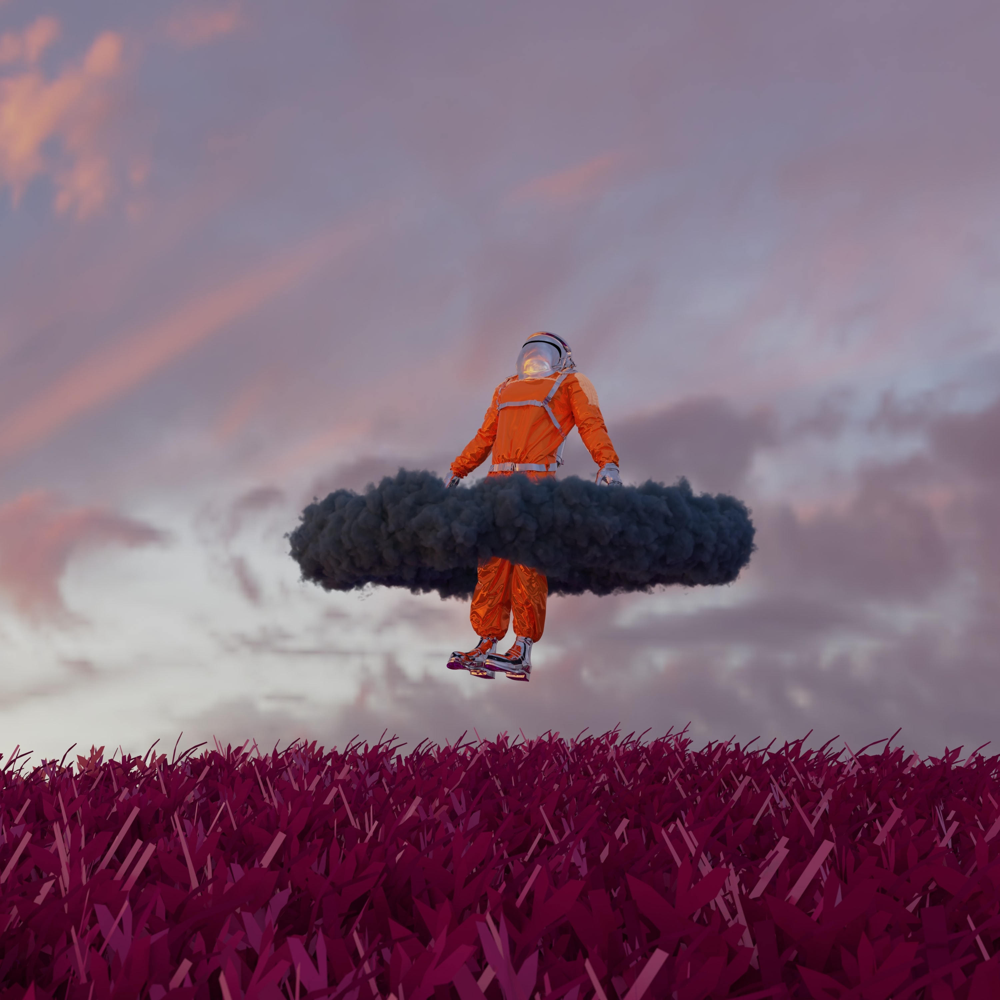

# COMP4555-ASG1 - Team Head in the Clouds
# Section 001/401
# Fall 2022
# Discord: https://discord.gg/gY8spy9Y

# Matthew Baluyot - Created a wall mod in where it would display a wall in a randomly generated location for the session. This would improve gameplay by increasing or decreasing the difficulty depending on where the wall has been placed.

# Brian Atuh - Added Redirect Mode. Allows the player to reverse the Y trajectory of the ball if they are moving in the opposing direction. This gives the player more control of the gameplay, and therefore, adds a layer of skill that advanced players can utilize against the opponent. 

#Latonia To - Added a function that provides encouragement to the player. The quote "Don't Give Up!" is shown when the player is losing and the quote "Nice! Keep it up!" is shown when the playing is winning. No message is displayed when the score is tied as the tension is high and a message could be distracting. This modification just provide a more 'human' touch to the game and encouragement may provide a sense of merit to keep playing. It also provides optimism which may also push our player to continue playing.

# Matthew Pham - Created a speed mod where the ball's velocity changes depending on player's input. This allows the user to adjust the difficulty, or if the player just wants a faster game in general. 